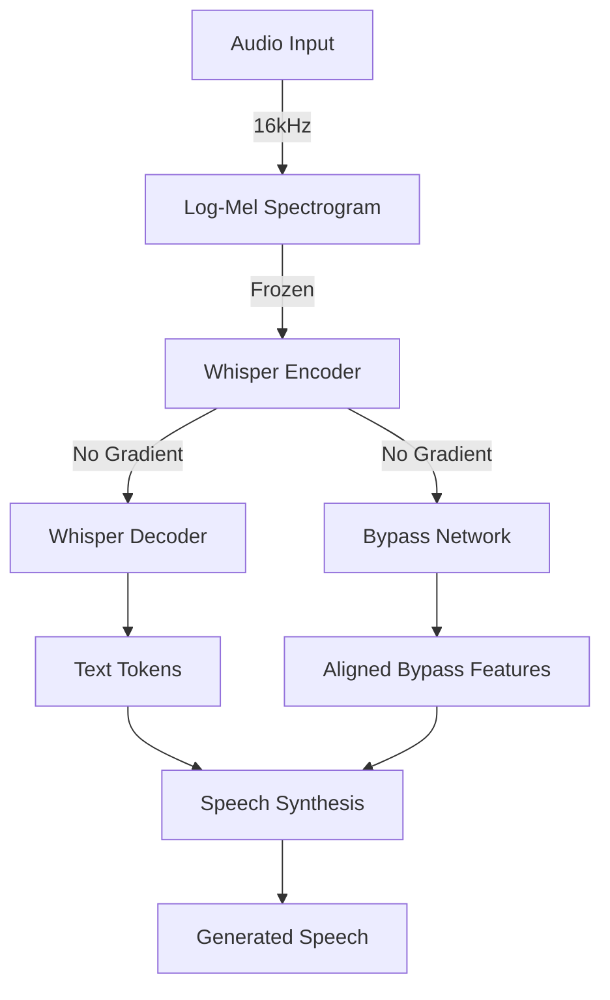
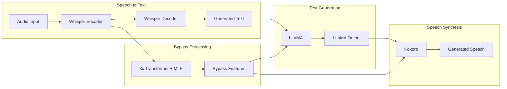

# Nuanced Speech 

A neural pipeline for preserving emotional characteristics in speech-to-speech conversion using Whisper and Kokoro.

## Overview

This project aims to preserve and transfer speech characteristics (emotion, tone, emphasis) through the text generation pipeline by creating a bypass connection from speech recognition to speech synthesis.

## Features

- Speech-to-text using OpenAI's Whisper
- Text-to-speech using Kokoro
- Emotional feature preservation through bypass network
- Diagnostic tools for model inspection

## Installation

```bash
# Clone the repository
git clone https://github.com/dant2021/a-research/nuanced-speech
cd nuanced-speech

# Install dependencies
pip install -r requirements.txt
```

## Quick Start

1. Place your audio files in the `data/` directory
2. Run the diagnostic:
```bash
python src/diagnostic.py
```

## Project Structure

```
nuanced-speech/
├── src/
│   ├── models/
│   │   ├── bypass.py       # Bypass network architecture
│   │   └── synthesis.py    # Kokoro synthesis integration
│   ├── training/
│   │   ├── train.py        # Training pipeline
│   │   └── dataset.py      # Dataset handling
│   ├── utils/
│   │   └── audio.py        # Audio processing utilities
│   └── diagnostic.py       # Diagnostic script
├── configs/
│   └── default_config.py   # Configuration
├── requirements.txt
└── README.md
```

#### Data Flow


#### Future Pipeline


