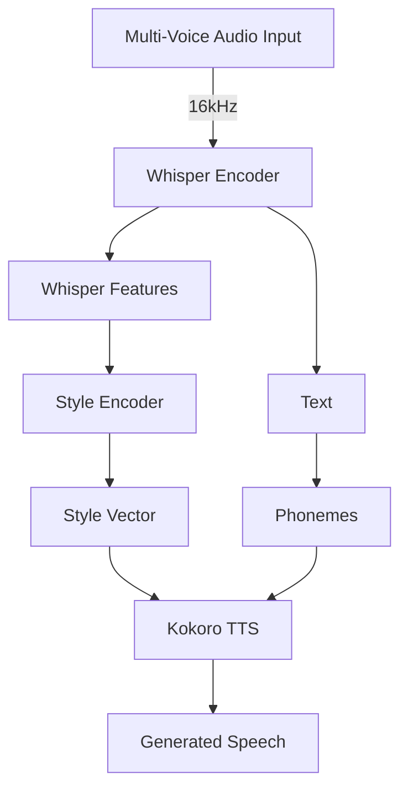

# Nuanced Speech 
A neural pipeline for preserving emotional characteristics in speech-to-speech conversion using Whisper and Kokoro.

## Overview
This project aims to preserve and transfer speech characteristics (emotion, tone, emphasis) through the text generation pipeline by creating a bypass connection from speech recognition to speech synthesis.

## Features
- Speech-to-text using OpenAI's Whisper
- Text-to-speech using Kokoro
- Emotional feature preservation through style encoder network
- Multi-voice training for style transfer
- STFT and style similarity loss functions for better audio quality

## Requirements
- 24GB GPU (RTX 3090 or equivalent)

## Important Note
To run this project, you need to remove the `@torch.no_grad()` decorator in the Kokoro `model.py` file to allow for gradient flow during training.

## Installation
```bash
# Clone the repository
git clone https://github.com/dant2021/a-research/nuanced-speech
cd nuanced-speech

# Install dependencies
pip install -r requirements.txt

# Install Kokoro (follow Kokoro installation instructions)
```

## Quick Start
```bash
# Run the training script
python train_v2_multispeech.py
```

## Project Structure
```
nuanced-speech/
├── train_v2_multispeech.py  # Main training script
├── custom_stft.py           # Custom STFT implementation
├── losses.py                # Loss functions implementation
├── models/                  # Saved models directory
└── outputs/                 # Generated audio outputs
```

## Architecture
The project uses a StyleEncoder to extract and transfer speech characteristics:

```python
class StyleEncoder(nn.Module):
    def __init__(self, input_dim=1280, style_dim=256):
        super().__init__()
        self.encoder = nn.Sequential(
            nn.Linear(input_dim, 512),
            nn.ReLU(),
            nn.Linear(512, 512),
            nn.Linear(512, 512),
            nn.ReLU(),
            nn.Linear(512, style_dim)
        )
    
    def forward(self, x):
        return self.encoder(x)
```
## Training Process
1. Creates multi-voice audio from a single text by assigning different voices to different sentences
2. Extracts Whisper features for each audio segment
3. Trains the StyleEncoder to predict style vectors that can reproduce the original voice characteristics
4. Uses a combination of STFT and style similarity losses

## Data Flow


## Known Behaviors
- The model tends to overfit to the training text and voices
- This is primarily due to the mean operation in the Whisper feature extraction and the expand function in style vector expansion
- I tried working with adverserial networks to remediate the issue, but the discriminator was too strong.

## Outputs
During training, audio samples are saved at specific epochs:
- `outputs/epoch_X_all_segments_predicted.wav` - Generated audio at epoch X
- `outputs/epoch_X_all_segments_reference.wav` - Reference audio at epoch X

## Future Improvements
- Integrate with LLM for end-to-end speech-to-speech pipeline
